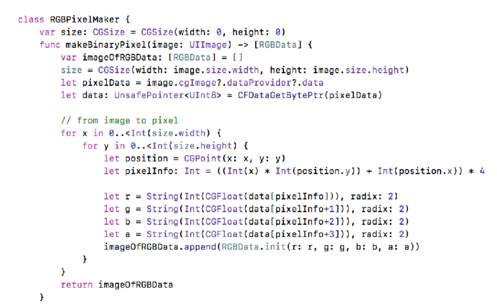

# Reality Stone
> 스테가노그라피 기법을 이용한 사진편집 앱

이미지A에 이미지B를 숨겨놓거나 이미 편집된 이미지A에서 이미지B를 추출하여 복원하는 기능이 주기능이다.

https://github.com/dely2p/WeeklyCodeReview/blob/master/180601_codereview_elly.pdf

1. 앨범에서 이미지 가져오기 (UIImagePicker)
	- 실행화면  
		
	- 코드리뷰 자료
	https://github.com/dely2p/WeeklyCodeReview/blob/master/180518_codereview_elly.pdf
	
	
2. 이미지A에 이미지B를 숨겨넣기(bit 연산)
	- 이미지A의 RGB값 하위 3bit에 이미지B의 상위 3bit를 추출하여 삽입
		
	- image를 RGB값으로 가져와서 bitwise 연산
		
		
	
	https://github.com/dely2p/WeeklyCodeReview/blob/master/180525_codereview_elly.pdf
	
	
3. bit 연산 데이터값을 다시 이미지로 만들기
	- 데이터 기반 이미지 생성
		
	- 실행화면  
		
	- 코드리뷰 자료	
	https://github.com/dely2p/WeeklyCodeReview/blob/master/180525_codereview_elly.pdf
	
	
	> 그런데 속도가 너무너무너무너무너무너무 느리다. 그래서 다시 생각함.
	
4. Metal을 이용하여 만들어보자
	- metal compute shader에서 bit 연산으로 하면 빠르게 처리할 수 있을 것으로 예상. -> 처리 속도 개선은 성공!
	- 그러나 compute shader에서 bit 연산 오차값이 크다는 사실 발견..
	- 실행화면 (오차값 개선 방법 찾고, 수정 예정)  
		
		